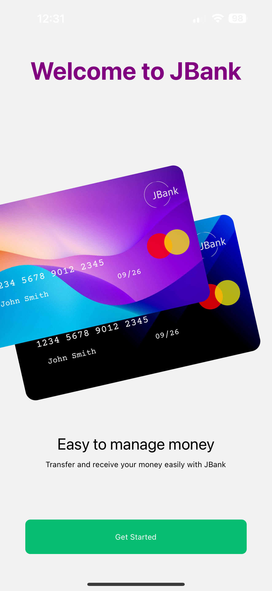
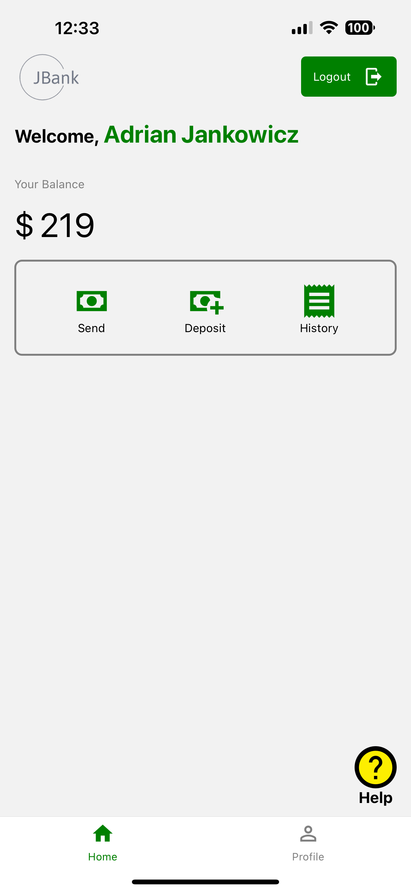
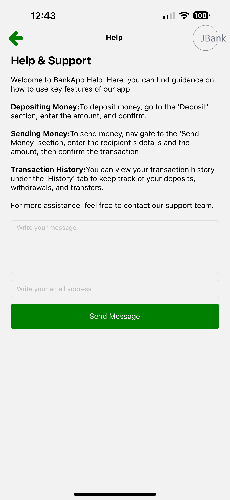
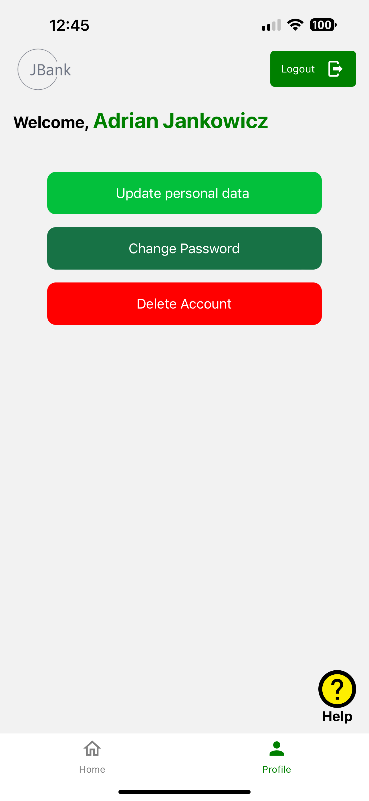
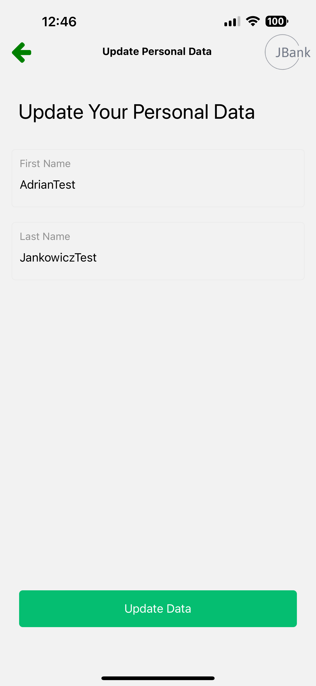
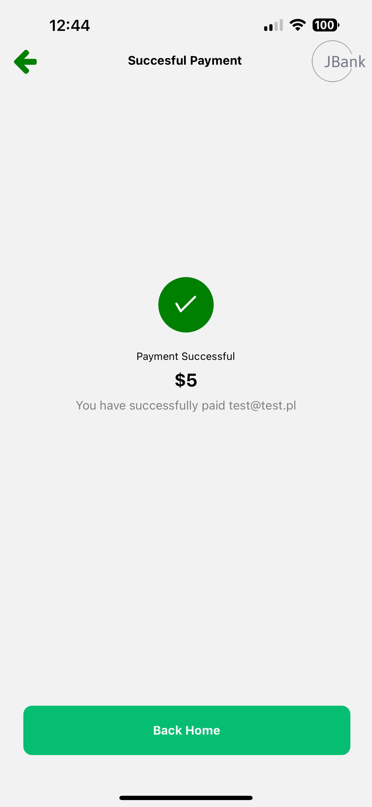

# JBank Mobile App

## Opis Projektu
JBank to nowoczesna aplikacja bankowa, zapewniająca szeroki zakres funkcji bankowych z intuicyjnym interfejsem użytkownika. Celem aplikacji jest zapewnienie użytkownikom łatwego i bezpiecznego dostępu do ich finansów.

### Główne Funkcje
- **Strona Startowa**: Pierwszy punkt kontaktu dla nowych użytkowników.
- **Rejestracja Użytkownika**: Proces rejestracji podzielony na etapy.
- **Logowanie Użytkownika**: System uwierzytelniania zabezpieczający dostęp do konta.
- **Strona Główna**: Wyświetlanie podstawowych informacji o koncie użytkownika.
- **Zmiany w Profilu Użytkownika**: Edycja danych osobowych, zmiana hasła, możliwość usunięcia konta.
- **Wysyłanie i Wpłacanie Pieniędzy**: Procesy finansowe, takie jak przelewy i wpłaty.
- **Pomoc dla Użytkownika**: Dostęp do wsparcia technicznego i informacji pomocniczych.

## Technologie i Narzędzia
- **React Native**: Framework do tworzenia aplikacji mobilnych.
- **Firebase**: Backend, uwierzytelnianie użytkowników, bazy danych, hosting i narzędzia analityczne.

## Instalacja i Uruchomienie

### Wymagania
- Node.js
- React Native CLI
- Android Studio / Xcode (dla emulatorów)

### Kroki Instalacji
1. Sklonuj repozytorium: `git clone https://github.com/adrianjankowicz/bank-app.git`
2. Przejdź do katalogu projektu: `cd JBank`
3. W folderze firebase utwórz plik konfiguracyjny `config.js` z danymi uwierzytelniającymi połączenie z bazą danych
4. Zainstaluj zależności: `npm install` lub `yarn install`
5. Uruchom aplikację:
   - Dla Android: `react-native run-android`
   - Dla iOS: `react-native run-ios`

